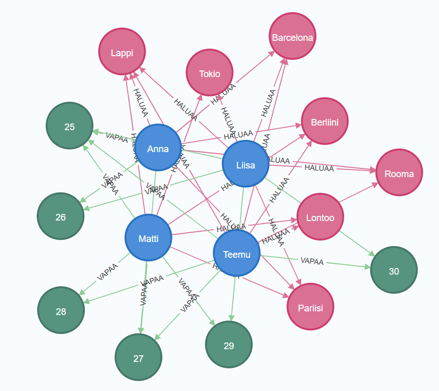

# Matkamatch

Matkamatch on graafitietokantaan (Neo4j) perustuva harjoitustyö, joka on toteutettu osana tietokantakurssia.
Sen tavoitteena on ratkaista lomasuunnittelun haaste: miten löytää yhteinen kohde ja ajankohta usean eri käyttäjän toiveiden joukosta.
Matkamatch mallintaa nämä risteävät toiveet verkostona, josta optimaaliset "matsit" löytyvät yhdellä kyselyllä.

### Miksi graafitietokanta (Neo4j)?

- **Suhteiden keskeisyys**: Matkasuunnittelussa tiedon välinen yhteys (kuka haluaa minne ja milloin) on tärkeämpää kuin itse tieto.
- **Suorituskyky**: Graafimallilla monimutkaiset ristiinkyselyt ovat nopeita ilman raskaita SQL-liitosoperaatioita (JOIN).
- **Joustavuus**: Uusia yhteystyyppejä (esim. kaverisuhteet tai budjettirajat) on helppo lisätä muuttamatta koko tietorakenteen skeemaa.

## Tietomalli

Tietokanta koostuu kolmesta solmutyypistä ja niiden välisistä suhteista:

### Solmut (Nodes):

**Henkilo**: Käyttäjän tiedot (nimi).

**Kohde**: Matkakohteet (kaupunki).

**Ajankohta**: Loma-aika (viikko).

### Suhteet (Relationships):

(:Henkilo)-[:HALUAA]->(:Kohde)

(:Henkilo)-[:VAPAA]->(:Ajankohta)



## Asennus ja testaus (Docker)

Projekti on paketoitu Dockerilla helppoa testausta varten.
Kloonaa repositorio:

```
git clone https://github.com/Janikarahikainen/matkamatch-neo4j.git
cd matkamatch-neo4j
```

Käynnistä tietokanta:

```
docker-compose up -d
```

Avaa hallintaliittymä:
Mene osoitteeseen http://localhost:7474

Käyttäjä: neo4j
Salasana: salasana123

### Tietokannan alustus

Kopioi ja aja setup.cypher tiedoston testidata Neo4j Browserin syötekenttään.
Tämä luo testidatan (henkilöt, kohteet ja viikot) sekä niiden väliset suhteet.

Huom: Skripti tyhjentää tietokannan ennen luontia (DETACH DELETE), joten voit ajaa sen uudelleen milloin tahansa.

### Kyselyt

queries.md tiedosta löytyy cypher kyselyt, joita voit koittaa. Niillä löydät mm. suosituimmat lomakohteen sekä parhaimman loma matchin.

## Pohdinta: Mallin arviointi ja jatkokehitys

### Mallin vahvuudet

- **Suorituskyky koosteissa**: Kyselyt, kuten "kuinka monta prosenttia porukasta on vapaana", ovat graafissa erittäin tehokkaita, koska ne perustuvat suoraan solmujen välisiin kytkentöihin ilman raskasta laskentaa.

- **Skaalautuvuus ryhmäkoon mukaan**: Dynaamiset kyselyt mahdollistavat sen, että järjestelmä toimii automaattisesti riippumatta siitä, onko käyttäjiä neljä vai neljätuhatta.

- Valittu malli on erinomainen pienen kaveriporukan lomasuunnitteluun. Se hyödyntää Neo4j:n vahvuuksia datan visualisoinnissa ja nopeassa hakuprosessissa.

### Mallin rajoitukset ja "Valemätsien" haaste

- Nykyisessä mallissa HALUAA- ja VAPAA-suhteet ovat toisistaan riippumattomia. Tämä aiheuttaa haasteen, jota kutsutaan semanttiseksi epäselvyydeksi.

- Tämä on tietoinen valinta, joka pitää mallin yksinkertaisena ja visuaalisena, mutta suuressa tuotantojärjestelmässä se voisi johtaa virheellisiin ehdotuksiin.

### Jatkokehitys:

- Jos tietokantaa kehitettäisiin eteenpäin, siirryttäisiin käyttämään Toive-solmua. Tällöin käyttäjä ei olisi suoraan yhteydessä kohteeseen, vaan hän loisi "Toive"-solmun, joka sitoo tietyn kohteen ja tietyn ajan tiukasti yhteen.

- Uusi rakenne: (:Henkilo)-[:TEKI]->(:Toive)-[:KOHDE]->(:Kohde) ja (:Toive)-[:AIKA]->(:Ajankohta).

- Tämä poistaisi kaikki valemätsit, mutta tekisi graafista monimutkaisemman lukea.
